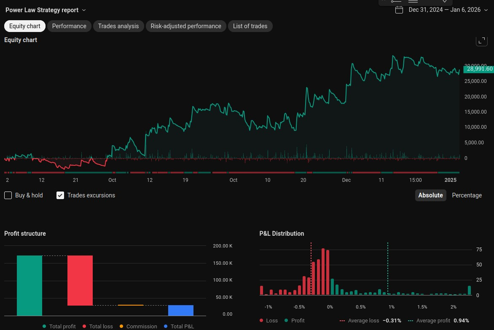

# BitMEX PowerLaw Bot

A trading bot for BitMEX. It applies a simple Bollinger bands strategy with a 
strong emphasis in letting good trades run along. 

## Strategy Performance

The strategy showed good performance in the Trading View simulation.

## Features

- Modular design for easy addition of other exchanges and strategies
- Supports trading with BitMEX and the PowerLaw strategy
- Configurable using environment variables (see config/bitmex.py)

## Getting Started

1. Clone the repository
2. Install the required packages using pip: `pip install -r requirements.txt`
3. Rename envfile to .env and setup your bitmex keys.
4. Run the bot using `python main.py`

## License

This project is licensed under the GPLv3 License. See LICENSE for details.
